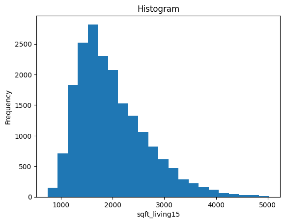
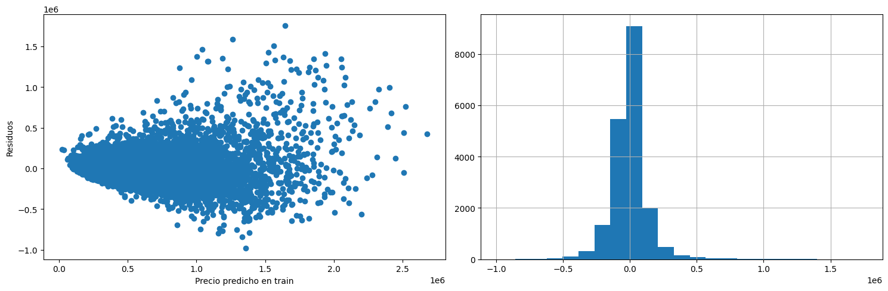

# Predicción de precios de viviendas

Luis Escárcega

---

# Introducción

Tenemos un dataset con 21 columnas y 21,613 viviendas, en el que hay:

- Columna id
- Columna fecha
- Columna target del precio de la vivienda
- 18 variables explicativas:
    - 12 variables numericas ("lat", "long", "sqft_living", "sqft_living15", "sqft_above", "sqft_lot", "sqft_lot15", "sqft_basement", "yr_built", "bathrooms", "bedrooms", "yr_renovated")
    - 6 variables categoricas ("zipcode", "grade", "floors", "condition", "view", "waterfront")

---

- Para este problema asumimos que estamos interesados en crear un modelo que explique el precio de la vivienda usando un subconjunto de las 18 caracteristicas anteriores.  

- En concreto, crearemos un modelo de regresión, seleccionando uno que minimice el error, tomando como metrica el R cuadrado. Esta metrica mide que porcentaje de la varianza del target es explicado por el modelo: un valor del 100% indica que el modelo explica en su totalidad el precio, mientras que un valor de 0% indica que el modelo es igual de bueno que tomar un promedio.

---

# Análisis exploratorio

En la siguiente gráfica podemos ver el número de observaciones por día.

---

En la siguiente figura se observa la media y desviación estándar del precio agregando los datos por dia, por semana y por mes. Se observa graficamente que, salvo por posibles outliers, el precio no cambian su distribución en el tiempo.

---

---

## Partición train-test

- Antes de continuar mirando la base, es necesario hace un particionado de esta en train y test a fin de usar una para entrenar el modelo y otra para entender el performance del modelo en un conjunto de datos nunca antes visto.

- Ya que el precio parece tener una distribución constante en el tiempo, seleccionamos la test haciendo un muestreo aleatorio sin reemplazo de la base de datos, tomando un 10% de los datos, que corresponde a aproximadamente 2100 observaciones.

- Si la distribución del precio cambiara, se seleccionaria el test tomando unicamente observaciones cercanas al presente.

---

## Más analisis exploratorios

Vemos que la base de datos no contiene valores nulos.

---

- En la siguiente figura vemos, para cada una de las 18 variables, la probabilidad que tiene la moda de aparecer en la base de datos. Se espera que para variables continuas, esta es aproximadamente cero. 

- También vemos, por cada 100 datos de la base de datos, cuantos valores distintos observamos. Variables categoricas deberían de tener un valor bajo.

---

---

- Con el fin de entender los rangos normales en los que se encuentran cada una de las variables, presentamos la siguiente tabla que tiene los percentiles 0.1% y 99.9%, así como la proporción de datos que caen por debajo y por arriba de esos valores, respectivamente.

- Los precios se encuentran entre $95,000 y $3,400,000.

- Viviendas donde el precio o alguna de las 18 caracteristicas se encuentran fuera de esos intervalos podrían considerarse outliers.

- Con esos umbrales, se tendría un 1.42% de outliers en la base de datos train.

---

---
## Análisis univariados

Enseguida hacemos un análisis univariado, tanto de las variables categoricas como numericas. 

Para las categoricas presentamos:

- Número de categorias
- Categoria más común
- Categoria con el precio más alto
- Categoria con el precio más bajo
- Indice de Herfindahl–Hirschman
- R cuadrado
- Intervalo de confianza del R cuadrado

---

Para las variables numericas presentamos:

- Media
- Mediana
- Desviación estándar
- Rango
- Sesgo
- Curtosis
- R cuadrado
- Intervalo de confianza del R cuadrado

---

## Análisis univariados: categoricas

Summary of zipcode:

Number of categories: 70
Most common category: 98103
Highest price: 98039
Lowest price: 98002
Herfindahl–Hirschman index: 0.31%
R2: 43.92%
R2 confidence interval: (42.23%, 46.31%)

---

Summary of grade:

Number of categories: 11
Most common category: 7
Highest price: 13
Lowest price: 4
Herfindahl–Hirschman index: 20.96%
R2: 49.39%
R2 confidence interval: (47.39%, 51.43%)

---

Summary of floors:

Number of categories: 6
Most common category: 1.0
Highest price: 2.5
Lowest price: 1.0
Herfindahl–Hirschman index: 27.76%
R2: 9.03%
R2 confidence interval: (7.91%, 10.32%)

---

Summary of condition:

Number of categories: 5
Most common category: 3
Highest price: 5
Lowest price: 2
Herfindahl–Hirschman index: 37.01%
R2: 0.75%
R2 confidence interval: (0.46%, 1.14%)

---

Summary of view:

Number of categories: 5
Most common category: 0
Highest price: 4
Lowest price: 0
Herfindahl–Hirschman index: 77.42%
R2: 15.86%
R2 confidence interval: (13.69%, 18.16%)

---

Summary of waterfront:

Number of categories: 2
Most common category: 0
Highest price: 1
Lowest price: 0
Herfindahl–Hirschman index: 97.29%
R2: 5.67%
R2 confidence interval: (3.43%, 8.29%)

---

## Análisis univariados: numericas

Summary of lat:

Mean: 47.56
Median: 47.57
Standard Deviation: 0.14
Range: 0.58
Skewness: -0.48
Kurtosis: -0.70
R2 coefficient: 26.97%
R2 confidence interval: (25.72%, 28.34%)

---

---

Summary of long

Mean: -122.22
Median: -122.23
Standard Deviation: 0.14
Range: 0.80
Skewness: 0.75
Kurtosis: 0.17
R2 coefficient: 3.09%
R2 confidence interval: (2.52%, 3.88%)

---

---

Summary of sqft_living:

Mean: 2066.75
Median: 1910.00
Standard Deviation: 872.73
Range: 6460.00
Skewness: 1.06
Kurtosis: 1.57
R2 coefficient: 43.34%
R2 confidence interval: (41.97%, 44.89%)

---

---

Summary of sqft_living15:

Mean: 1982.67
Median: 1840.00
Standard Deviation: 672.01
Range: 4290.00
Skewness: 1.03
Kurtosis: 1.10
R2 coefficient: 33.90%
R2 confidence interval: (32.38%, 35.61%)

---

---

Summary of sqft_above:

Mean: 1780.36
Median: 1560.00
Standard Deviation: 799.78
Range: 5590.00
Skewness: 1.22
Kurtosis: 1.57
R2 coefficient: 30.82%
R2 confidence interval: (29.40%, 32.60%)

---

---

Summary of sqft_lot:

Mean: 13786.97
Median: 7590.00
Standard Deviation: 29841.32
Range: 437500.00
Skewness: 7.31
Kurtosis: 65.63
R2 coefficient: 5.03%
R2 confidence interval: (4.23%, 5.94%)

---

---

Summary of sqft_lot15

Mean: 12016.51
Median: 7610.00
Standard Deviation: 22426.29
Range: 296628.00
Skewness: 7.00
Kurtosis: 57.72
R2 coefficient: 6.25%
R2 confidence interval: (5.37%, 7.34%)

---

---

Summary of sqft_basement

Mean: 286.39
Median: 0.00
Standard Deviation: 430.79
Range: 2490.00
Skewness: 1.42
Kurtosis: 1.27
R2 coefficient: 8.58%
R2 confidence interval: (7.36%, 10.00%)

---

---

Summary of yr_built:

Mean: 1971.03
Median: 1975.00
Standard Deviation: 29.37
Range: 115.00
Skewness: -0.47
Kurtosis: -0.65
R2 coefficient: 2.76%
R2 confidence interval: (2.20%, 3.47%)

---

---

Summary of bathrooms

Mean: 2.11
Median: 2.25
Standard Deviation: 0.75
Range: 4.75
Skewness: 0.33
Kurtosis: 0.25
R2 coefficient: 28.78%
R2 confidence interval: (27.06%, 30.60%)

---

---

Summary of bedrooms

Mean: 3.37
Median: 3.00
Standard Deviation: 0.88
Range: 7.00
Skewness: 0.43
Kurtosis: 0.87
R2 coefficient: 10.35%
R2 confidence interval: (9.20%, 11.46%)

---

---

Summary of yr_renovated

Mean: 81.18
Median: 0.00
Standard Deviation: 394.26
Range: 2014.00
Skewness: 4.65
Kurtosis: 19.63
R2 coefficient: 1.54%
R2 confidence interval: (0.96%, 2.29%)

---

---

## Conclusiones del análisis univariado

- Con el fin de simplificar el modelo final, dejaremos de considerar todas aquellas variables donde el intervalo de confianza del R2 solo contiene valores inferiores a ese umbral; es decir, cuyo R cuadrado es estadisticamente inferior al 5%.

- No consideraremos entonces "condition", "long", "yr_built", "yr_renovated".

- Las variables categorica y continua con R2 más grande son, respectivamente, "grade" y "sqft_living".

---

## Preprocesamiento

Hacemos un preprocesamiento como sigue con las variables restantes:

- Quitamos viviendas donde una de sus caracteristicas es atipica, i.e., se sale de los rangos definidos arriba. En los datos de entrenamiento también quitamos viviendas con precios atipicos.
- Estandarizamos las variables numericas.
- Para cada variable categorica, unimos niveles iterativamente hasta que todos los niveles tienen un precio promedio diferente estadisticamente a los demás. Esto se hace con una pruba Z.
- Las variables categoricas se transforman usando one-hot encoding.

---

## Modelos

Los modelos seleccionados para este ejercicio son dos modelos lineales Ridge. En el primer modelo, el target es el precio; en el segundo, es el logaritmo del precio.

---
 
## Primer modelo

Usando validación cruzada con 5 particiones y un grid para alpha (el parametro de penalización L2), obtenemos un alpha optimo de 0.2, que maximiza el R2.

---

Enseguida vemos el scatter plot de los valores ajustados en train respecto a los residuos.

---

El siguiente grafico corresponde al QQ plot de los residuos, comparando con una distribución normal.

---

El R2 en train es del 80.81%, mientras que en test es de 78.70%.

---

## Segundo modelo

Similarmente al primer modelo, seleccionamos en este caso un alpha de 0.02.

---

De manera análoga al primer modelo, presentamos las siguientes graficas de los residuos, así como el QQ plot.

---

---

El R2 de este modelo es en train del 84.85%, mientras que en test es de 84.31%.

---

## Conclusiones

Un modelo lineal es preferible sobre el logaritmo del precio que sobre el precio mismo por las siguientes razones:

- Los residuos del primer modelo claramente no son normales. Esto se aprecia claramente en el QQ plot. En el segundo modelo, los residuos tienen una distribución similar a una Gaussiana. Para hacer inferencias estadisticas, es por lo tanto preferible el segundo modelo.

- Hay un ligero sobre ajuste en el primer modelo, mientras que en el segundo esto no se percibe.

- El ajuste del segundo modelo es superior al primero en sus respectivos targets. (Claramente no es una comparación justa al tratarse de targets diferentes).

